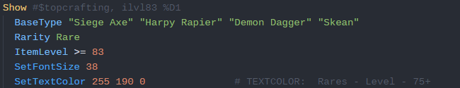
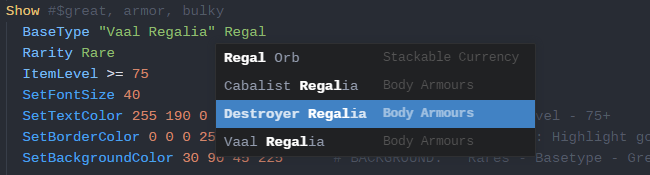
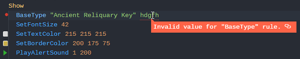

# Path of Exile: Item Filters

This package provides additional support for the creation of Path of Exile filters within Atom, making it easier to create item filters for the game.

## Features
### Grammar

Allowing your color scheme to apply to item filters.

### Autocompletion

Providing you with suggestions, including items from the game where appropriate, as you edit.

### Linting

Error checking for item filters within Atom.

## Configuration

There are several configuration variables available, allowing you to turn off features that you don't personally like. These variables can be found in the Atom setting's panel for this package.

A whitelist for both classes and bases is also available in that configuration menu. These will allow you to edit a filter for future versions of the game.
